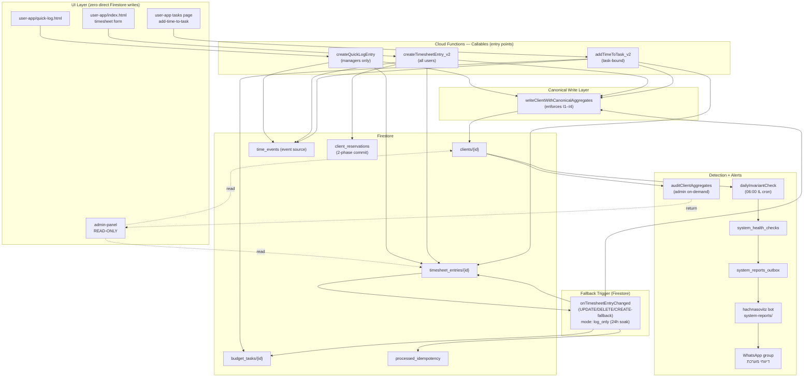

# Time-Tracking Flow — Deep Audit

> ## 📌 מסמך תקף — אך מיושן בשני דברים (עודכן 2026-07-23)
>
> המנגנונים שמתוארים כאן אומתו מול הקוד ועדיין נכונים. **שתי הסתייגויות לפני שקוראים:**
>
> 1. **ההכרזה על "steady-state קנוני" כבר לא נכונה.** המסמך קודם לעיצוב-מחדש של
>    בעלות יחידה על אגרגטים (`docs/SINGLE-OWNER-AGGREGATE-DESIGN.md`, 2026-06) ולממצאי
>    2026-07 (`docs/FINDINGS-STAGE-TRANSITION-MECHANISM-2026-07.md`,
>    `docs/FINDINGS-INTERNAL-OFFICE-BILLING-LEAK-2026-07.md`,
>    `docs/PLAN-HOURS-STAGE-INTEGRITY-2026-07.md`). המערכת אינה במצב סופי.
> 2. **שני שמות אוספים במסמך שגויים.** `client_reservations` (שורות 55, 344, 488) ו-
>    `processed_idempotency` (שורות 56, 117, 321) אינם קיימים בקוד. השמות בפועל הם
>    `reservations` (`functions/timesheet/helpers.js:147`) ו-`processed_operations`
>    (`functions/clients/index.js:71`). אל תשאילת אותם בשמות שבמסמך.
>
> לסיווג שירותים ראה `docs/architecture/SERVICE_TYPES.md`.
> מסמכים שהוחלפו לגמרי: [`docs/archive/README.md`](../archive/README.md).

**תאריך:** 2026-05-18
**מסמך מאת:** Claude (deep audit, read-only)
**סטטוס:** מסמך סקירה — מקור אמת לזרימת מעקב השעות אחרי PR-A/B/C/D/E
**Target audience:** מהנדסי backend, ארכיטקטים, צוות RAG/AI עתידי

---

## Executive Summary

זרימת מעקב השעות במערכת מורכבת מ-**4 שכבות** ו-**3 entry points** עיקריים לכתיבה. אחרי PR-A (גשר ארכיטקטוני) + PR-B (×14 callsite migrations) + PR-C (זיהוי) + PR-D (תיקון) + PR-E (טיפוסים), המערכת נמצאת במצב **steady-state קנוני**: כל כתיבה לאגרגטים של לקוח עוברת דרך helper יחיד שאוכף invariants I1-I4.

**מאפיינים מפתח:**
- **Single canonical write path:** `writeClientWithCanonicalAggregates` — 14/14 callsites מהוגרצו
- **Three writers:** `createQuickLogEntry`, `createTimesheetEntry_v2`, `addTimeToTask_v2`
- **One fallback trigger:** `onTimesheetEntryChanged` (UPDATE/DELETE/CREATE-fallback)
- **Idempotency, optimistic locking, event sourcing, 2-phase commit:** כולם נשמרו בעת המיגרציה
- **Detection layers:** on-demand audit (`auditClientAggregates`) + nightly cron (Check 6 = client-aggregate I1-I4, Check 7 = package-level consumption drift, ב-`dailyInvariantCheck`)
- **Alert path:** outbox pattern → hachnasovitz bot → קבוצת "דיווחי מערכת"
- **Read side:** Admin Panel display-only; אפס כתיבות ישירות ל-Firestore מ-UI

---

## Architecture Overview



---

## Layer 1: UI Submission

מבנה אחרי PR-B: **אפס** כתיבות ישירות ל-Firestore מ-UI. כל הכתיבות עוברות דרך 3 callables.

| Surface | File | Callable | Validation |
|---------|------|----------|------------|
| Quick Log (managers) | [quick-log.html](apps/user-app/quick-log.html) + [quick-log.js:1349-1449](apps/user-app/js/quick-log.js) | `createQuickLogEntry` | Client-side (6 fields: clientId, serviceId, branch, minutes, description, date) + idempotencyKey |
| Timesheet (all users) | [user-app index.html] + [timesheet-adapter.js:122-170](apps/user-app/js/modules/timesheet-adapter.js) | `createTimesheetEntry_v2` | Adapter adds idempotencyKey (FNV-1a hash) + expectedVersion (optional) |
| Add time to task | tasks page → addTimeToTask_v2 | `addTimeToTask_v2` | task-bound: requires taskId |
| Admin Panel | [timesheet.html](apps/admin-panel/timesheet.html) + [tasks.html](apps/admin-panel/tasks.html) + [workload.html](apps/admin-panel/workload.html) | **READ-ONLY** | N/A |

**Idempotency key:** generated client-side (FNV-1a hash of date+minutes+clientId+description). Stored in `processed_idempotency` collection. Replay-safe.

**Optimistic locking:** `expectedVersion` (optional) — adapter passes it through; backend validates against `client._version`. Mismatch → `aborted` error.

---

## Layer 2: Callable Layer (Writers)

שלושת ה-callables משתפים את אותו דפוס כללי:

```
1. Auth (checkUserPermissions)
2. Idempotency check (return early if already processed)
3. Input validation (clientId / minutes / date / description / serviceId)
4. Reservation (2-phase commit start) — for createTimesheetEntry_v2 only
5. Transaction:
   a. Read client document (capture _version)
   b. Read task document (if taskId)
   c. Optimistic-lock check (if expectedVersion)
   d. ServiceId resolution + on-client validation
   e. Blocked-service check
   f. -10h floor guard (override-aware)
   g. Compute deduction (5 paths — see below)
   h. Helper write (canonical aggregates)
   i. Entry overage flags write
   j. Task aggregates update (FieldValue.increment)
   k. Timesheet entry create
   l. Register idempotency
6. Commit reservation
7. Event source write (createTimeEvent — TIME_ADDED)
8. Audit log (logAction)
9. Return response
```

### Callable comparison

| Aspect | createQuickLogEntry | createTimesheetEntry_v2 | addTimeToTask_v2 |
|--------|---------------------|-------------------------|------------------|
| Role gate | managers + admin | all users | all users (task-bound) |
| Reservation flow | No | Yes (createReservation + commitReservation) | Yes |
| isInternal bypass | No (always real client) | Yes (internal_office case) | Yes |
| Task binding | optional | optional | required |
| Optimistic-lock | No | Yes (expectedVersion) | No |
| Idempotency | Yes | Yes | Yes |
| Event sourcing | TIME_ADDED | TIME_ADDED | TIME_ADDED |

### The 5 Deduction Paths

הזרימה הפנימית של חישוב הניקוי לפי סוג שירות:

| Path | Service shape | Action |
|------|---------------|--------|
| **A. hours + package** | `HoursService` with active package | `applyHoursDelta(services, serviceId, packageId, deltaMinutes)` |
| **B. hours service-only** | `HoursService` without active package | `applyHoursDeltaServiceOnly(services, serviceId, deltaMinutes)` — service-level only |
| **C. fixed** | `FixedService` | בלי ניקוי (just `work.totalMinutesWorked += delta`) — לא מקצה לאגרגטים של הלקוח |
| **D. legal_procedure + stage + package** | `LegalProcedureService` (hourly stage with active pkg) | `applyLegalProcedureDelta(services, lpId, stageId, packageId, delta)` |
| **E. legal_procedure + stage-only** | `LegalProcedureService` (hourly stage, no pkg) | `applyLegalProcedureDeltaStageOnly(services, lpId, stageId, delta)` |

מקור: [aggregators.js](functions/src/modules/deduction/aggregators.js). שמרני: מחזיר `null` ב-target not found (לא יוצר phantom hours).

---

## Layer 3: Helper Canonicalization

[functions/shared/client-writer.js](functions/shared/client-writer.js) — **single source of truth** לכתיבת אגרגטים של לקוח.

### Contract

```js
await writeClientWithCanonicalAggregates(transaction, clientRef, partialUpdate, options)
// partialUpdate: non-restricted fields (status, services, etc.)
// options: { caller, auditMeta?, mode? }
// returns: { aggregates, previousAggregates, strippedKeys, written, mode }
```

### Flow

```
1. Read client (transaction.get)
2. Capture previousAggregates
3. Strip RESTRICTED_KEYS from caller's partialUpdate
4. Merge currentData + sanitized partialUpdate
5. Filter null services
6. recomputeTotalHours(services) — excludes FIXED + legal_procedure+fixed
7. calcClientAggregates(services, totalHours) — invariants I1-I4
8. Add auditMeta if provided (lastModifiedAt, lastModifiedBy)
9. Assert I1-I4 (mode-gated):
   - 'enforce' (default): throw on violation, write aborts
   - 'log_only': log + write canonical anyway
   - 'disabled': skip assertion
10. transaction.update(clientRef, finalPayload)
```

### RESTRICTED_KEYS

קבועה ב-helper. אסור ל-caller להגדיר ידנית:
- `isBlocked` — נגזר מ-`hoursRemaining <= 0 && no override`
- `isCritical` — נגזר מ-`0 < hoursRemaining <= 5`
- `hoursUsed` / `hoursRemaining` / `minutesUsed` / `minutesRemaining`
- `totalHours` — recomputed מ-services

### Invariants I1-I4

| ID | Statement |
|----|-----------|
| I1 | `isBlocked === true` ⇒ `hoursRemaining <= 0` AND no `overrideActive` AND no `overdraftResolved.isResolved` AND not isInternal |
| I2 | `isBlocked === true` ⇒ at least one billable service exists |
| I3 | `isCritical === true` ⇒ `isBlocked === false` AND `0 < hoursRemaining <= 5` |
| I4 | `isBlocked` + `isCritical` mutually exclusive |

מקור: [calcClientAggregates ב-aggregates.js](functions/shared/aggregates.js).

### Mode kill-switch

[functions/shared/enforcement-mode.js](functions/shared/enforcement-mode.js). Global config דרך `system_settings/invariant_enforcement` (cached 60s). Per-call override דרך `options.mode`.

**שימוש נוכחי:**
- כל ה-callables: default mode (`enforce`)
- `onTimesheetEntryChanged` trigger: `mode: 'log_only'` (24h soak window אחרי PR-B.12; cleanup ב-PR-B.12.1)

---

## Layer 4: Fallback Trigger

[functions/triggers/timesheet-trigger.js](functions/triggers/timesheet-trigger.js) — Firestore v2 trigger על `timesheet_entries/{entryId}`.

### When the trigger runs

| Event type | deductedInTransaction | Trigger action |
|------------|----------------------|----------------|
| CREATE | `true` | **SKIP** — callable handled everything |
| CREATE | `false` / undefined | Fallback path — runs full deduction |
| UPDATE | n/a | Always runs (no callable for edits) |
| DELETE | n/a | Always runs (refund flow) |
| Self-write (only isOverage/overageMinutes changed) | n/a | SKIP — guard prevents loop |

### Special handlers

- **Service transfer:** UPDATE that changes `serviceId`. Two-legged: leg1 reverses on old service, leg2 applies on new. אם target leg2 לא נמצא → abort (לא יוצר phantom hours).
- **Missing packageId fallback:** מחפש first eligible package (`status` in `['active', 'pending', 'overdraft', 'depleted']` + `hoursRemaining > -10` unless override).
- **All packages depleted:** counts at service level only via `applyHoursDeltaServiceOnly`.

### Phase 3 ordering inside transaction

1. Read idempotency record
2. Read clientRef
3. Read taskRef (if taskId)
4. **Helper write** (FIRST — does own internal get+write)
5. Entry overage update (CREATE/UPDATE only)
6. Task update (if taskId)
7. Idempotency record write

### Observability surfaces

- `TRIGGER_FALLBACK_WITH_TASK` warning: trigger ran CREATE-fallback for a `taskId` entry. Catches callable bugs where `deductedInTransaction !== true` was not set.
- `invariant_violation_log_only`: `mode: 'log_only'` writes that violated assertions. Quantitative metric for PR-B.12 soak.

---

## Layer 5: Aggregates & Display

### Aggregate Levels

זרימת aggregates נכתבת בארבע שכבות מקוננות:

```
PACKAGE (HoursPackage)
    hoursUsed, hoursRemaining, hours, status
       ↓ summed
STAGE (Stage — only for legal_procedure)
    totalHours, hoursUsed, hoursRemaining (or totalHoursWorked for fixed)
       ↓ summed
SERVICE (Service)
    totalHours, hoursUsed, hoursRemaining (or work for fixed)
       ↓ summed via canonical aggregates
CLIENT (Client)
    totalHours, hoursUsed, hoursRemaining,
    minutesUsed, minutesRemaining,
    isBlocked, isCritical
```

Helper writes CLIENT layer canonically. Manual writes still happen at PACKAGE/STAGE/SERVICE layers (nested inside `services[]`, not RESTRICTED).

### Display side

| Surface | File | Reads | Writes |
|---------|------|-------|--------|
| Admin Timesheet | [timesheet.html](apps/admin-panel/timesheet.html) | `getPaginatedEntries` | None |
| Admin Workload | [workload.html](apps/admin-panel/workload.html) | `WorkloadService` (computed) | None |
| Admin Tasks | [tasks.html](apps/admin-panel/tasks.html) | `getBudgetTasks` | None |
| Reports | [ReportGenerator.js](apps/admin-panel/js/managers/ReportGenerator.js) | `getTimesheetEntries` + filters | None |
| User Quick Log | [quick-log.html](apps/user-app/quick-log.html) | clients + services | **createQuickLogEntry** |
| User Timesheet | [user-app index.html] | clients + my entries | **createTimesheetEntry_v2** |

**Export formats (ReportGenerator):** HTML print-friendly, PDF (method exists, library TBD), Excel (method exists, library TBD).

---

## Cross-Cutting Concerns

### 1. Idempotency

| Where | Storage | Key |
|-------|---------|-----|
| Callable layer | `processed_idempotency/{idempotencyKey}` | FNV-1a hash from UI |
| Trigger layer | `processed_trigger_events/{event.id}` | Cloud Functions event ID, 72h TTL |

הגנה כפולה: callable + trigger מבודדים. Replay של אותה pulkוצ' לא יוצרת כפילות.

### 2. Optimistic Locking

`client._version` — מספר שלם. Atomic increment ב-helper כל write. אם UI שולח `expectedVersion` והוא לא תואם — תקיעה עם `aborted`. ה-UI לוקח את ה-version החדש דרך Firestore listener וריטריי.

`_version` **לא** ב-RESTRICTED_KEYS. ה-callable מחשב `nextVersion = currentVersion + 1` ומעבירה לפיין-לוד של ה-helper.

### 3. Event Sourcing

[functions/timesheet/helpers.js](functions/timesheet/helpers.js) — `createTimeEvent({ eventType, before, after, ... })`. נכתב POST-transaction לקולקציה `time_events`. eventType supported:
- `TIME_ADDED`
- `TIME_REMOVED`
- `TIME_EDITED`
- `TIME_TRANSFERRED`

מאפשר reconstruction של מצב ההיסטוריה. **לא במשתמש פעיל ב-UI** עדיין — תשתית לרגע שנרצה ביקורת מלאה.

### 4. Reservation (2-Phase Commit)

[functions/timesheet/helpers.js](functions/timesheet/helpers.js) — `createReservation` (לפני transaction) + `commitReservation` (אחרי). `client_reservations` collection. כשל ב-transaction → `rollbackReservation`.

מגן מפני זליגת hours כאשר transaction אטומי + side effects חיצוניים (event sourcing, audit log) צריכים להתבצע ברצף ושומרים על קונסיסטנטיות.

### 5. Internal-Case Bypass

[functions/timesheet/internal-case.js](functions/timesheet/internal-case.js). כשמשתמש מסמן `isInternal: true`:
- מעבר ל-`internal_office` clientId
- **דילוג** על client write entirely (helper לא נקרא)
- entry נוצר עם `clientId: 'internal_office'`, `clientName: 'פנימי'`
- task update כן רץ (אם יש taskId)

מטרה: זמן פנימי לא משפיע על אגרגטים של לקוח אמיתי. `internal_office` יוצא מכל ה-detection scans (SKIP_CLIENTS).

### 6. Override / Overdraft Resolved

`service.overrideActive: true` או `service.overdraftResolved: { isResolved: true }` — שניהם עוקפים את invariant I1. הלקוח לא נחסם גם כש-`hoursRemaining <= 0`.

Migration callables:
- [setServiceOverride](functions/services/index.js) (PR-B.1)
- [setServiceOverdraftResolved](functions/services/index.js) (PR-B.2)

### 7. -10h Floor

הגנה אחרונה לפני deduction: אם `hoursRemaining` יורד מתחת ל-`-10`, התראה. ניתן לעקוף עם `hasOverride: true` ב-payload (admin-only).

מקור: `validators.js` ב-deduction module.

### 8. Service Transfer (UPDATE serviceId)

UPDATE של timesheet_entries שמשנה את `serviceId`. רק ה-**trigger** מטפל (אין callable לעריכת רשומה). Logic two-legged מטופל ב-`applyServiceTransfer`. אם leg1 nor leg2 לא נמצאו — abort עם error log.

### 9. DELETE Refund

DELETE של timesheet_entry. רק ה-**trigger** מטפל. ה-trigger מחשב `minutesDelta = -before.minutes` ומריץ deduction inverse. ה-helper כותב aggregate חדש (canonical). Task actualMinutes מתעדכן ב-FieldValue.increment(-before.minutes).

---

## Recent Architectural Fixes Timeline

| Date | PR | What | Impact |
|------|-----|------|--------|
| 2026-05-13 | #266 | unified `calcClientAggregates` — removed parallel write path that mis-set `isBlocked` | Root cause fix for 23 corrupted clients |
| 2026-05-13 | #267 | admin-table type display | Cosmetic — show correct type per service |
| 2026-05-17 | #274 | `isOnHold` field — manual freeze (separate from derived isBlocked) | New invariant boundary |
| 2026-05-17 | (PR-A.4) | `writeClientWithCanonicalAggregates` helper introduced | Architectural gap closure |
| 2026-05-17 | (PR-A.5) | structured violation logging — `clientInvariantViolations` collection | Detection at write time |
| 2026-05-17 | (PR-A.6) | enforcement mode kill-switch (`enforce` / `log_only` / `disabled`) | Per-write + global control |
| 2026-05-17/18 | PR-B.1–B.14 | 14 callsite migrations to helper | Architecture closure: every write canonical |
| 2026-05-18 | PR-D #297 | `auditClientAggregates` + `repairClientAggregates` admin callables | On-demand drift fix |
| 2026-05-18 | PR-C.1 #298 | Check 6 in `dailyInvariantCheck` (I1-I4 drift) | Nightly automated detection |
| 2026-06-21 | PR-DRIFT-1 | Check 7 in `dailyInvariantCheck` (`package.hoursUsed` vs Σentries-by-packageId + orphan/dangling/duplicate signals) + fixed-service Check-0 false-positive fix | Detect package-level CONSUMPTION drift — the rung Check 5 (capacity) never covered |
| 2026-05-18 | PR-C.2-fns #299 | outbox trigger on `system_health_checks` FAIL | Alert pipeline (law-office-system side) |
| 2026-05-18 | PR-C.2-bot #2 (hachnasovitz) | listener + WhatsApp send | Alert pipeline (bot side) |
| 2026-05-18 | PR-E #300 | discriminated union for services + ClientV2 | Type safety |

After this audit: **0 known architectural gaps**. The 14 PR-B callsites cover every write path. PR-D + PR-C.1 cover detection. PR-C.2 covers alerting. PR-E gives type safety.

---

## Performance Hot Spots

### 1. `dailyInvariantCheck` (cron 06:00 IL)
- Reads: full `clients` collection + full `timesheet_entries` collection + `budget_tasks` (status in ['פעיל','הושלם'])
- **Cost:** O(N_clients × N_entries_per_client) — currently low (~100 clients × ~50 entries). Acceptable.
- **Risk:** if clients grow to ~5000+, refactor to streamed/chunked iteration.

### 2. Callable transactions
- Each callable holds a transaction with 2-3 reads + 4-5 writes. Helper adds 1 read (re-read of client).
- Typical: ~150-300ms per callable.
- Hot user actions: timesheet form submission (~5-10/minute peak).

### 3. Trigger fan-out
- onTimesheetEntryChanged fires on every `timesheet_entries` write — including the entry write from a callable.
- 50% of fires are no-ops (`deductedInTransaction: true` early return).
- Self-write loop blocked by guard (only `isOverage`/`overageMinutes` changed → skip).

### 4. Helper overhead
- ~10-30ms added per write vs. previous manual writes. Negligible.

---

## RAG / AI Candidates

מסמך זה משמש בסיס ל-RAG/AI עתידי. שלוש נקודות כניסה טבעיות לשילוב AI:

### A. Read-only contextual assistance (Phase 1 — safest)

**Data sources to feed RAG:**
- `clients/{id}` — שמות, סטטוס, שירותים פעילים, אגרגטים
- `timesheet_entries` — היסטוריית עבודה (filterable by employee/client/date)
- `budget_tasks` — משימות פתוחות + תקציב לעומת בפועל
- `time_events` (event source — currently underused) — היסטוריה אטומית של כל שינוי
- `clientInvariantViolations` — חריגות עבר
- `system_health_checks` — health snapshots לאורך זמן

**Use cases:**
- "מה מצב התיק של לקוח X החודש?"
- "כמה שעות נשארו ל-Y בשירות Z?"
- "מי מהעובדים קרוב לחריגה השבוע?"
- "תן לי סיכום שבועי של כל המשימות הפתוחות"

**Architecture:**
- Vector store של מסמכים מסונכרן מ-Firestore (Daily ETL or trigger-based)
- LLM שולח כל query עם relevant context retrieved
- אין כתיבה ל-Firestore מ-LLM ב-phase 1

### B. Time-entry assistant (Phase 2 — write-side with validation)

**Use cases:**
- "תרשום שעתיים על לקוח X על משימה Y"
- "תפצל את 4 השעות של היום בין X (60%) ו-Y (40%)"

**Architecture:**
- LLM יוצר structured payload → עובר דרך אותם callables (`createTimesheetEntry_v2`)
- Helper + invariants עדיין שומרים על קונסיסטנטיות
- אישור משתמש לפני submit (preview screen)

### C. Anomaly detection + predictive alerts (Phase 3)

**Data sources:** kanonization של אגרגטים + drift היסטורי + entry patterns.

**Use cases:**
- "התראה: לקוח X יחרוג מהשעות תוך 3 ימים בקצב הנוכחי"
- "Y לא רושמת שעות 3 ימים — שכחה או חופש?"
- "אפיון חריג: עליה של 40% בשעות פנימי בשבוע האחרון"

**Architecture:**
- Time-series analysis על time_events
- LLM מקבל summary statistics ומציע narrative + actions
- Integration עם `system_reports_outbox` → קבוצת WhatsApp הקיימת

### Data quality requirements

- כל הנתונים שיוזנו ל-RAG חייבים לעבור דרך `auditClientAggregates` קודם (zero drift)
- timestamps מנורמלים ל-Asia/Jerusalem
- `internal_office` excluded from billable-related queries
- Fixed services excluded from "hours remaining" queries

---

## Open Questions

1. **Event sourcing utilization:** `time_events` collection קיימת אבל לא בשימוש פעיל ב-UI. צריך החלטה: לבטל או לבנות replay/audit UI סביבה?
2. **Reservation collection:** `client_reservations` — כמה ארוך נשמר? יש cleanup cron? (Likely no — open question.)
3. **`isOnHold` semantics:** מתי בדיוק נכנס לתוקף? Manual freeze vs. derived isBlocked מובדל אבל לא מתועד היכן ב-UI כל אחד מוצג.
4. **Mobile UI:** מוגדר? Currently web-only. בשלב RAG/AI — WhatsApp בוט מספיק או דרושה אפליקציה?
5. **Multi-tenancy:** מערכת עכשיו single-office. אם משכפלים — איך service account + Firestore Rules?
6. **PR-B.12.1 cleanup:** עוד open. דורש 24h soak observations אחרי PR-B.12 deployment.

---

## Appendix: File Reference

### Core Cloud Functions
- [functions/timesheet/index.js](functions/timesheet/index.js) — createQuickLogEntry + createTimesheetEntry_v2
- [functions/timesheet/helpers.js](functions/timesheet/helpers.js) — createTimeEvent, reservation, idempotency
- [functions/timesheet/internal-case.js](functions/timesheet/internal-case.js) — internal_office bypass
- [functions/addTimeToTask_v2.js](functions/addTimeToTask_v2.js) — task time addition
- [functions/triggers/timesheet-trigger.js](functions/triggers/timesheet-trigger.js) — fallback trigger
- [functions/triggers/system-reports-outbox-trigger.js](functions/triggers/system-reports-outbox-trigger.js) — alert outbox writer
- [functions/shared/client-writer.js](functions/shared/client-writer.js) — canonical helper
- [functions/shared/aggregates.js](functions/shared/aggregates.js) — calcClientAggregates + isFixedService + invariants
- [functions/shared/enforcement-mode.js](functions/shared/enforcement-mode.js) — mode kill-switch
- [functions/admin/repair-aggregates.js](functions/admin/repair-aggregates.js) — audit + repair callables (PR-D)
- [functions/scheduled/index.js](functions/scheduled/index.js) — dailyInvariantCheck (Check 6 = I1-I4 client aggregates, Check 7 = package consumption drift)
- [functions/src/modules/aggregation/](functions/src/modules/aggregation/) — applyHoursDelta, applyLegalProcedureDelta, etc.

### TypeScript types
- [types/services.ts](types/services.ts) — discriminated union (PR-E)
- [types/index.ts](types/index.ts) — re-export + legacy types

### UI
- [apps/user-app/quick-log.html](apps/user-app/quick-log.html) + [quick-log.js](apps/user-app/js/quick-log.js)
- [apps/user-app/js/modules/timesheet.js](apps/user-app/js/modules/timesheet.js)
- [apps/user-app/js/modules/timesheet-adapter.js](apps/user-app/js/modules/timesheet-adapter.js)
- [apps/admin-panel/timesheet.html](apps/admin-panel/timesheet.html) (read-only)
- [apps/admin-panel/js/managers/ReportGenerator.js](apps/admin-panel/js/managers/ReportGenerator.js)

### Tests
- [tests/unit/aggregates/calc-client-aggregates.test.ts](tests/unit/aggregates/calc-client-aggregates.test.ts) — invariant tests
- [tests/unit/types/services.test.ts](tests/unit/types/services.test.ts) — type guards (PR-E)
- [functions/tests/*-canonical-helper.test.js](functions/tests/) — per-callable migration tests (PR-B.1–B.14)
- [functions/tests/repair-aggregates.test.js](functions/tests/repair-aggregates.test.js) — PR-D
- [functions/tests/daily-invariant-check-i1-i4.test.js](functions/tests/daily-invariant-check-i1-i4.test.js) — PR-C.1

### Rubrics
- [.claude/rubrics/pr-a-*.md](.claude/rubrics/) — architectural foundation
- [.claude/rubrics/pr-b-*.md](.claude/rubrics/) — 14 migrations
- [.claude/rubrics/pr-c-1.md](.claude/rubrics/pr-c-1.md) — nightly cron extension
- [.claude/rubrics/pr-c-2-fns.md](.claude/rubrics/pr-c-2-fns.md) — outbox trigger
- [.claude/rubrics/pr-d.md](.claude/rubrics/pr-d.md) — audit + repair
- [.claude/rubrics/pr-e.md](.claude/rubrics/pr-e.md) — TS types

---

**End of audit.** מסמך זה מתוחזק כ-source-of-truth לזרימת מעקב השעות. כל שינוי ארכיטקטוני (PR חדש שמגע בכתיבה) חייב לעדכן את המסמך במקבילה.
